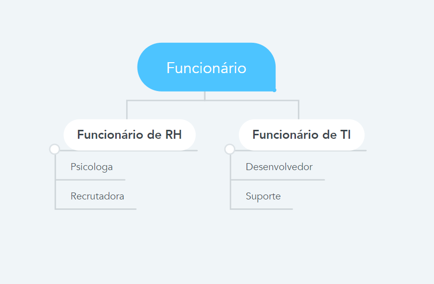

# Projeto final para a disciplina de Python

## 1. Introdução

Nosso programa vai contextualizar o registro de funcionarios de uma Startup  através de uma programação orientada a objetos, na qual vamos abstrair diversas funções e cargos, que são comuns em setores presentes no mercado de trabalho.  

## 2. A hierarquia

Pensando em um cenário real de uma empresa, a seguinte hierarquia será implementada. 

Teremos funcionário e esses funcinários são divididos entre funcionários de RH e funcionários de TI, os funcionários de RH podem ser psicólogos e recrutadores, já os funcionários de TI podem ser desenvolvedores e suporte.

## 3. Herança

Como é possível perceber, o esquema de funcionários da nossa empresa pode ser implementado utilizando o conceito de herança da orientação a objeto. Assim, a nossa classe pai será "Funcionário" as classes "Funcionário de RH" e "Funcionário de TI" serão classes filhas e por sua vez as classes Psicologa, Recrutadora, Desenvolvedor e Suporte serão classes netas como pode ser observado na imagem abaixo.

## 4. Polimorfismo

Para implementar o polimorfismo utilzaremos o metodo "Pagar_funcionario" que será um método da classe Funcinário mas que será implementado diferente por cada um dos funcionários do sistema.

(Adicionar aqui a imagem do método pagar_funcionario)

## 5. Encapsulamento

(INCOMPLETO descrição do emcapsulamento)

## 6. Relaório de cobertura de código

(INCOMPLETO relatório de cobertura)

Todo funcionário precisa ter um número de nome, idade e matrícula  

Todo funcionário precisa ser pago

Os funcionários de RH precisam  ter metas de 
recrutamento e quantidade recrutada

Todo funcionário de RH pode recrutar e palestrar

Os funcionários de TI precisam ter senha da rede e um computador

Todo funcionário de TI pode fazer login na rede

Os funcionários do cargo Psicólogo (a) precisam ter meta de contratações, quantidade de contratações, CRP e sala de atendimento

Todo psicólogo pode ...

Os funcionários do cargo de Recrutador (a) precisam ter as vagas disponíveis

Todo recrutador pode...

Os funcionários do cargo de Desenvolvedor (a) precisam ter uma senioridade e conhecimento em linguagem de programação

Todo Desenvolvedor ...

Os funcionários do cargo de Suporte de TI precisam ter um setor e uma especialidade

Todo funcionário de Suporte de TI.